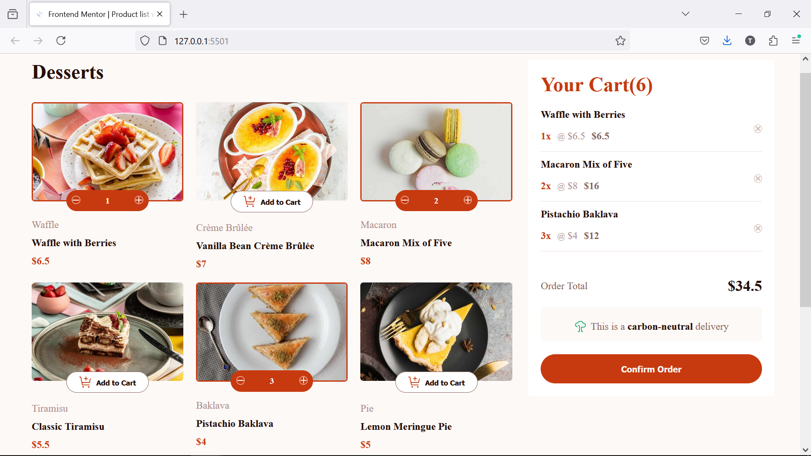

# Frontend Mentor - Product list with cart solution

This is a solution to the [Product list with cart challenge on Frontend Mentor](https://www.frontendmentor.io/challenges/product-list-with-cart-5MmqLVAp_d). Frontend Mentor challenges help you improve your coding skills by building realistic projects.

## Table of contents

- [Overview](#overview)
  - [The challenge](#the-challenge)
  - [Screenshot](#screenshot)
  - [Links](#links)
- [My process](#my-process)
  - [Built with](#built-with)
  - [What I learned](#what-i-learned)
  - [Continued development](#continued-development)
  - [Useful resources](#useful-resources)
- [Author](#author)
- [Acknowledgments](#acknowledgments)

## Overview

### The challenge

Users should be able to:

- Add items to the cart and remove them
- Increase/decrease the number of items in the cart
- See an order confirmation modal when they click "Confirm Order"
- Reset their selections when they click "Start New Order"
- View the optimal layout for the interface depending on their device's screen size
- See hover and focus states for all interactive elements on the page

### Screenshot



### Links

- Solution URL: [Add solution URL here](https://your-solution-url.com)
- Live Site URL: [Add live site URL here](https://your-live-site-url.com)

## My process

### Built with

- Semantic HTML5 markup
- CSS custom properties
- Flexbox
- CSS Grid
- Mobile-first workflow

### What I learned

What i have learned while working throgh this project is to create elements, modify elements content, delete elements, traverse through alements in the DOM using JS and realsied that you can heve few lines of code in the index.html file.

```js
// Create Elements Functions
function createAnElement([elementName, classes, id, innerHtml]) {
  const element = document.createElement(elementName);
  if (classes !== '') {
    element.classList = classes;
  }
  if (id !== '') {
    element.id = id;
  }
  if (innerHtml !== '') {
    element.innerHTML = innerHtml;
  }
  return element;
}

// Modfying element's content
const cartCount = document.getElementById('cartCount');
let countAdd = Number(cartCount.innerText) + 1;
cartCount.innerText = countAdd;

// Removing and element on the DOM
cartContainer.nextElementSibling.remove();

//Traversing the DOM elements
const cartItems = document.querySelectorAll('#cart__item');
let newCartTotal = 0;
let newCartItems = 0;
cartItems.forEach((cartItem) => {
  const itemsTotal =
    cartItem.children[1].children[0].children[2].children[0].innerText;
  const cartTotal = document.getElementById('cartTotal');
  newCartTotal = newCartTotal + Number(itemsTotal);
  cartTotal.children[0].innerText = newCartTotal;

  newCartItems =
    newCartItems +
    Number(cartItem.children[1].children[0].children[0].firstChild.textContent);
  const cartCount = document.getElementById('cartCount');
  cartItem.children[1].children[0].children[0].firstChild = newCartItems;
  cartCount.innerText = newCartItems;
});
```

### Continued development

In future projects i want to focus more on working with JavaScript to manipulate the DOM elements, improve on the way I write my code until im comfortable and move on to using frameworks like React or Vue.

### Useful resources

- [CSS Grid Crash Course by Brad Traversy]() - This helped me in organising elements on a wide screen.
- [Morden JavaScript from the Beginning by Brad Traversy]() - This helped me understand how to create elements, modify elements content, delete elements, traverse through alements in the DOM using JS. I'd recommend it to anyone still learning this concept.

## Author

- Website - [Takudzwa Kevin Mukonzi](https://takudzwa-kevin-mukonzi.github.io/My_Website)
- Frontend Mentor - [@yourusername](https://www.frontendmentor.io/profile/yourusername)
- Twitter - [@yourusername](https://www.twitter.com/yourusername)

## Acknowledgments

I'm always taking courses from Brad Traversy Media, he is realy the person who inspires me to keep on working everyday. I realy appreciate the time he puts in to share his knowledge with the rest of the world. He is my number one instructor.
